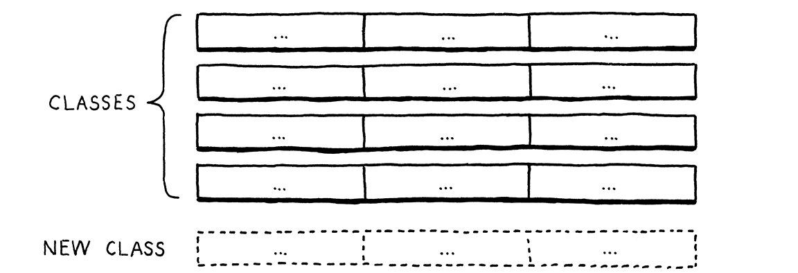

# [Crafting Interpreters By Robert Nystrom](https://craftinginterpreters.com/)
---
## 🌟 Why This Book Matters to Me
*Crafting Interpreters* by Robert Nystrom has had a profound impact on my growth as a programmer. I was fortunate that my mentor recommended it to me — an act that truly changed my direction in life and deepened my appreciation for programming languages.
At first, I was too overwhelmed with classes and projects to give the book the attention it deserved. But after completing my senior projects, I finally had a free summer, and I knew it was the perfect time to dive in.
I was preparing to continue my work as a research assistant in academic programming languages and take a graduate-level compilers course in the fall. What better way to prepare than by learning from one of the most beloved books on the subject?
I won’t lie I was nervous. Compilers have a reputation, especially among undergrads. At my university, the compilers course hadn’t been offered in six years until my mentor decided to revive it.
Instead, most students (including myself) took **Automata and Formal Languages**, a class infamous for its difficulty. It was tough: 60% of the grade came from 10 in-person quizzes, and the remaining 40% was the final exam. Many of us were just hoping for a passing grade.
But my friends and I welcomed the challenge we had already taken **Game Engine Architecture**, another one of the toughest classes offered. It was in that class that I met my mentor. So, we dove in headfirst, and to our surprise, we walked away with A’s and B’s.
It was during *Automata* that I began to develop a deep respect for programming language theory. It was like finishing a marathon brutal, but incredibly rewarding. And I knew I wanted to keep running.
Reading *Crafting Interpreters* felt like the next natural step. The book helped me understand not just the technical side of interpreters, but the elegance of language design.
This repository documents my learning. It’s filled with notes, explanations, and code as I explore and implement my own interpreter based on Robert Nystrom's JLOX. It's also a way to share what I’ve learned with others who might be on a similar journey.
However, this is more than just a study guide it’s a showcase of my dedication, curiosity, and commitment to growth as a programmer. If you're a recruiter visiting from my resume, I hope these notes give you a glimpse into the wonderful world of programming languages.
I also hope this repository is like a glass of fresh water after all the calculator apps and ChatGPT wrapper projects you may have seen. Not that those projects are wrong we all start somewhere, but a little language from a great book is exciting.
I really hope this repository inspires you to look deeper into the languages we use every day. Regardless, I’m proud of what I’ve built here. It’s been the highlight of my summer and one of the most rewarding programming experiences I’ve had so far.
---
## 💌 A Message to the Author
To Robert Nystrom — thank you. Your work has inspired me deeply. I was so grateful for the free web version of the book that I bought a physical copy to support you. You’ve created something truly special, and I hope more developers find it and are inspired as I have been.
If anyone reading this has enjoyed these notes or learned from them, I strongly encourage you to visit the author’s website:
👉 [https://craftinginterpreters.com](https://craftinginterpreters.com)
---
## Extra Resources That Are Also Used
1. \:green\_book: [Engineering a Compiler, 3rd Edition](https://www.amazon.com/Engineering-Compiler-Keith-D-Cooper-dp-0128154128/dp/0128154128/ref=dp_ob_title_bk)
    * A modern compiler construction textbook used in my graduate compilers course. It goes deeper into code generation, optimization, and runtime systems, helping bridge the gap between interpreters (as covered in *Crafting Interpreters*) and full compiler pipelines.
    * Topics include semantic elaboration, control flow translation, code shape, and register allocation — essential for understanding how high-level syntax becomes executable machine code.

2. \:blue\_book: [An Introduction to Formal Languages and Automata, 7th Edition](https://www.jblearning.com/catalog/productdetails/9781284231601?srsltid=AfmBOor_LG5CsmjrTsjRq3gkfZp7SCaGOGg8Zn_uVAMoXPEpZ-AiiiMr)
    * A foundational theory textbook that expands on the automata, grammars, and parsing theory briefly touched upon in *Crafting Interpreters*.
    * It covers topics like DFA/NFA, regular languages, context-free grammars, and parsing — especially useful for understanding the formal structures behind lexical analysis and syntax trees.

3. \:orange\_book: [Programming Language Pragmatics, 5th Edition](https://mlscott14627.github.io/PLP5e_online/)
    * A comprehensive book on programming language design and implementation. It explores how different language features are expressed and executed, reinforcing the connection between theory and practice.
    * Useful for understanding semantics, type systems, concurrency, runtime memory models, and design tradeoffs. Shows how other real-world languages handle similar constructs.
---
- [Scanning and Tokenization](#scanning-and-tokenization)
    - [File Processing](#file-processing)
    - [Lexemes and Tokens](#lexemes-and-tokens)
    - [The Scanner Class](#the-scanner-class)
    - [Token Matching](#token-matching)
    - [Tokenizing Strings, Numbers, Identifiers](#tokenizing-strings-numbers-identifiers)

- [Representing Code in the AST](#representing-code-in-the-ast)
    - [Grammar Overview](#grammar-overview)
    - [Expression Types](#expression-types)
    - [The Expr Classes](#the-expr-classes)
    - [Functional vs OOP Organization](#functional-vs-oop-organization)

- [Visitor Pattern](#visitor-pattern)
    - [Why Visitor Pattern?](#why-visitor-pattern)
    - [Interface and Accept Method](#interface-and-accept-method)
    - [AstPrinter Example](#astprinter-example)

- [Parsing Expressions (Recursive Descent)](#parsing-expressions-recursive-descent)
    - [Ambiguity in Grammar](#ambiguity-in-grammar)
    - [Precedence and Associativity](#precedence-and-associativity)
    - [The Recursive Grammar Rules](#the-recursive-grammar-rules)
    - [AST vs Parse Tree](#ast-vs-parse-tree)
    - [Parser Implementation](#parser-implementation)

- [Further Chapters (7+)](#further-chapters)
    - [Ch. 7 Notes Placeholder](#ch-7-notes-placeholder)
    - [Ch. 8 Notes Placeholder](#ch-8-notes-placeholder)
# Scanning and Tokenization
## File Processing
Let's take our first real step up the language mountain by finding the trail we'll hike — this trail begins with processing the source file. Once we've read in the source, we can begin creating lexemes and tokens, the foundational pieces of any language.
1. The first step is locating our source file. Think of the "finding a trail analogy," the file path is the trail. We use `Paths.get(path)` to create a Path object that represents the file's location in the file system.
2. Once we have the path, we read the entire file into memory using `Files.readAllBytes(Path)`. This method efficiently loads all the file contents at once, rather than reading it piece by piece. For our interpreter's purposes, this approach is more efficient as we need access to the entire program during analysis.
3. After reading the raw bytes, we need to convert them into a format we can work with. We create a String using the system's default character encoding (typically UTF-8). This conversion transforms the raw bytes into readable text that contains our source code.
4. With our source code now in string format, we pass it to the `run` method. This begins the actual interpretation process, starting with lexical analysis (or "lexing"), where our scanner breaks down the source code into tokens. MAKE SURE TO READ VERY CARFULLY. We are creating lexems and tokens at the same time, instead of doing two pass throughs.
The entire process transforms our source file from raw bytes into tokens that our interpreter can understand and process. This is main point of chapter 4, creating meaningful tokens from raw characters.
```C#
{
byte[] bytes = Files.readAllBytes(Paths.get(path));

run(new String(bytes, Charset.defaultCharset()));
}
```

## Creating Our Lexical Analyzer
- Our next exciting adventure is turning our source code into meaningful pieces that our interpreter can understand. We'll break this down into two main steps: creating lexemes and then converting them into tokens.
### The Process ofFile Processing and Creating A Scanner
1. We have our trusty `runFile(String path)` method, which handles our source file. Along the way, we have a helpful companion called `hadError` a boolean variable in our Lox class that stops us if something goes wrong. our source file. Along the way, we have a helpful companion called `hadError` - a boolean variable in our Lox class that stops us if something goes wrong.
2. The real excitement begins when we create our Scanner object: We're creating a new Scanner and handing it our source code. It's going to examine every character and figure out what it means. Breaking down our source code into meaningful pieces that our interpreter can understand.
3. Finally, we print out our tokens to make sure everything looks right. It's like a final inspection before sending our tokens on their way to the parser.
```java
Scanner scanner = new Scanner(source);
```
The Full `run()` Function
```java
private static void run(String source)
{
    if(hadError) System.exit(65);
    Scanner scanner = new Scanner(source);
    List<Token> tokens = scanner.scanTokens();

    for (Token token : tokens)
    {
        System.out.println(token);
    }
}
```

## scanTokens Method
1. The first step into Lexeme and Tokenization 
2. Three tracking variables used for character count for Lexemes
```
Starting character of the lexeme
private int start = 0;
Current character of the lexeme being evaluated
private int current = 0;
Current line used for error reporting
private int line = 1;
```

## Notes on `scanTokens()` from *Crafting Interpreters*
1. It's important to remember that this function ultimately returns a list of tokens. These tokens represent the smallest meaningful elements (lexemes) of the source code — such as identifiers, literals, operators, etc. This list will be consumed later by the parser.
2. The `while` loop controls how we move through the source code. It continues scanning tokens until we reach the end of the file. Here's the `isAtEnd()` function that helps determine when to stop:
3. 3.```java
   private boolean isAtEnd()
   {
       return current >= source.length();
   }```
4. 4.**Tracking Lexeme Boundaries with `start = current;`**
   The line `start = current;` updates the `start` index to match `current`, marking the beginning of a new lexeme. This update happens at the start of each loop iteration, before scanning the next token. Tracking `start` and `current` separately helps identify the substring for the current token. It’s easy to get confused when these are updated in different places, so I’ll make sure to point out exactly when and why that happens as we go forward. 
5. 5.**Calling `scanToken()`**
   The `scanToken()` function is called every iteration of the loop. This function is where the actual work of identifying and creating tokens occurs — it examines the current character(s) and builds the appropriate `Token` object based on what it sees. We'll take a deep dive into `scanToken()` shortly, but for now, just know that it’s the core engine of the scanner. 
6. 6.**Adding the End-of-File Token**
   Once we've scanned all tokens and exited the loop, we add an End-of-File (EOF) token:
   ```
   tokens.add(new Token(EOF, "", null, line));
   ```
   This token is used to signal that no more tokens remain in the source. Parsers rely on this to know when they’ve reached the end of input. 
7. Finally, we return the complete list of tokens back to the caller — typically a `run()` or `interpret()` function that kicks off the rest of the compilation process (parsing, interpretation, etc.). 
8. We’re making steady progress along the lexing and parsing path. The next big step is to dive into the `scanToken()` function itself. This is where all the real action happens — identifying keywords, numbers, operators, string literals, and more.
   Here’s the full `scanTokens()` function for reference:
   ```java
   List<Token> scanTokens()
   {
       while (!isAtEnd())
       {
           start = current;
           scanToken();
       }
       tokens.add(new Token(EOF, "", null, line));
       return tokens;
   }
   ```
   
## scanToken and some important helper functions
- `char c = advance();` Is the very first thing that happens with in our scan `scanToken` function. Lets take a look at this little helper function. In fact I want you to think of this function as the steps on the trail. Every advance gets us one more step closer to finishing the lexical and tokenization trail.
### advance()
1. `source.charAt(current)`:
    - Takes a snapshot of the character at our current position
    - Think of it like placing your finger on a specific letter in a book
    - This is the exact character that is returned before we increment our position
2. `current++`:
    - Increments our position counter
    - Like moving your finger to the next letter
3. `return c`:
    - Returns the character we found
    - This is the character we'll analyze in our scanner
4. Dont get confused we are not incrementing then examining the character we return the character then increment
The complete reference code
```java
private char advance() 
{
    char c = source.charAt(current);
    current++;
    return c;
}
```
## Single character Lexeme
- Single character Lexemes are relatively easy. Remember we are not just creating lexemes. We identify a lexeme and create a token by assigning the lexeme a type. 
- Remember `Token(TokenType type, String lexeme, Object literal, int line)` Dont be to concerend about the other paramaters as of now. The main point being, that we are finding the token type using the cases
  - Naturally we need to continue our journy by looking at how the `addToken()` function works. This leads to some intresting behavior like java overloading.
    ```
    case '(': addToken(LEFT_PAREN); break;
    case ')': addToken(RIGHT_PAREN); break;
    case '{': addToken(LEFT_BRACE); break;
    case '}': addToken(RIGHT_BRACE); break;
    case ',': addToken(COMMA); break;
    case '.': addToken(DOT); break;
    case '-': addToken(MINUS); break;
    case '+': addToken(PLUS); break;
    case ';': addToken(SEMICOLON); break;
    case '*': addToken(STAR); break;
    case '!':
    addToken(match('=') ? BANG_EQUAL : BANG); break;
    case '=':
    addToken(match('=') ? EQUAL_EQUAL : EQUAL); break;
    case '<':
    addToken(match('=') ? LESS_EQUAL : LESS); break;
    case '>':
    addToken(match('=') ? GREATER_EQUAL : GREATER); break;
    case '/':
    if (match('/'))
    {
        while (peek() != '\n' && !isAtEnd()) advance();
    }
    else
    {
        addToken(SLASH);
    }
    break;
    ```
    
### addToken() Function
- This is called a method override if only token type is passed then the literal is null. This is because These tokens have meaning through their type alone, and don't need to store any additional value. 
- The actual function `addToken()` and its invocation type is determined during compile time based on the arguemnts that are passed to the function. 
- If we call the first `addToken()` which will happen for the above cases, we pass in the type and a null literal
Full Function
```java
private void addToken(TokenType type)
{
    addToken(type, null);
}
```
1. This function can be invoked one of two ways. The wrapper function of the single argument `addToken()` or by a multi argument `addToken()`
2. We create string representations of the tokens from one large string, which is our source code generated from the file our via the REPL
3. `String text = source.substring(start, current);` for example '(' would be parsed as 'start' = 0 'current' = 1 since `substring()` since the second index of substring is exclusive this creates a new string around 0,0 which is '('
4. `tokens.add(new Token(type, text, literal, line));` `tokens` is a list thus the `add` function adds a new token to the list
5. `new Token` creates a new token from four values we just assigned during our previous functions
6. `type` Was determined via the cases, which were chosen via the scanner using a character to determine the case
7. `text` Is the string we just created, in fact text is a lexeme the smallest understandable part for our interpreture.
8. `literal` This is what gives the lexeme meaning premoting it to token status. Remember we are creating lexemes then turning them into tokens in a single pass, efficency
9. `line` Is for error reporting not a lot of intresting stuff here
Full Function
```java
private void addToken(TokenType type, Object literal)
{
    // '(' would be start = 0 current = 1 so substring would be from 0-0 creating "("
    String text = source.substring(start, current);
    tokens.add(new Token(type, text, literal, line));
}
```

## Lexemes consisting of two characters. 
- `>=` is not two tokens `> =` but actually one token consisting of two characters. There also exist a single token `>` and `=`. This leaves a key question how do we handle these cases approprately
- Ergo the `match()` function. If the next character is not a match then we have a since instance of our token a `>`, but if the next symbol is a match we have a `>=`
    ```
    case '!':
    addToken(match('=') ? BANG_EQUAL : BANG); break;
    case '=':
    addToken(match('=') ? EQUAL_EQUAL : EQUAL); break;
    case '<':
    addToken(match('=') ? LESS_EQUAL : LESS); break;
    case '>':
    addToken(match('=') ? GREATER_EQUAL : GREATER); break;
  ```

### match() function
- The `match()` function is the method that allows us to determine if we have a single or multicharacter lexeme. 
- Keep in mind the varible `current` already incremented upon the completion of the advance function so this looks at the next character
1. `private boolean match(char expected)` We return a boolean value which is returned to `match('=') ? GREATER_EQUAL : GREATER`. This is just some syntactic sugar for an if statment. The argument expected is the character we are looking for
2. `if (isAtEnd()) return false;` We should check if we are at the end `isAtEnd()` function was previously explained. If we are at the end of the file we must have a single character lexeme
3. This is where the actual matching occurs if the character we are currently at in our source file(**Remember we have already incremented current so we are at the next symbol**) Matches our expected. We have correctly identified our multi character lexeme.
4. `current++` Is what consumes the symbol and allows us to start the next lexeme. See this is not a token quite yer until we invoke the `addToken()` method
5. `return true;` If we find the expected symbol then
Full Function
```java
private boolean match(char expected)
{
    if (isAtEnd()) return false;
    if (source.charAt(current) != expected) return false;
    current++;
    return true;
}
```

### Symbols that we can ignore
- **Remember** if we do not envoke the `addToken()` method our symbol will be consumed without creating a token. This happens until we return a `EOF` token. 
- The while loop will keep invoking the `scanToken()` function, which first calls the `advance()` function incrementing our current
- This means that the cases that do not invoke `addToken()` will simply disregard the character as we do not create a lexeme from it.
1. `case ' ':` Is for encountering white space, we simply consume the symbol.
2. `case `\r`:` This symbol is used to print special symbols. Thus we should not create lexeme when this symbol is encounterd. 
3. `case '\t'` Tabs dont mean anything to us thus we can disregard it.
```
case ' ': case '\r': case '\t':
    break;
```

### The Cases Involving Strings
- `case '"': string(); break;` the case "" may seem confusing is it '''' or "" or '"' believe it or not they are all different.
- The `' " '` had the space dramatized to show what this actually means. We have a case to detect the begining of a string. Thus `''` is required to wrap a character.
- Since strings begin with `"` we then create `'"'` and that denotes a case in which we encounter the first qoutes `"`
1. while (peek() != '"' && !isAtEnd()) while the next character is not the closing qoutations `'"'` and we are not at the end we can continue to loop
2. The `peek()` function simply returns the next character with out consuming the symbol. This is used to look for the ending of the string  
```
private char peek()
{
  if (isAtEnd()) return '\0';
  return source.charAt(current);
} 
```
3. `if (peek() == '\n') line++;` If we encounter a new line symbol simply increment which line we are on
4. `advance();` strings dont contain lexems, they are a lexeme. So just continue to advance through the symbol
5. If our string does not end our user forgot to finish the string. Lets make sure to give them a helpful hint 
`if (isAtEnd())
        {
            Lox.error(line, "Unterminated string.");
            return;
        }`
6. `advance();` Once the while group breaks and we know the next character is the end of the string. Lets advance to that symbol
7. `String value = source.substring(start + 1, current - 1);` We now create our string from our source file preparing it to be tokenized.
```
// If source contains: "hello"
//                     ^    ^
//                start    current
// start = position of first quote
// current = position after last quote
// With start = 0 and current = 7:
// substring(1, 6) gives us just "hello" without the quotes
```
8. `addToken(STRING, value);` Now we promote our lexeme to a token! nice!
Full code
``` java
private void string()
    {
        while (peek() != '"' && !isAtEnd())
        {
            if (peek() == '\n') line++;
            advance();
        }

        if (isAtEnd())
        {
            Lox.error(line, "Unterminated string.");
            return;
        }

        // The closing ".
        advance();

        // Trim the surrounding quotes.
        String value = source.substring(start + 1, current - 1);
        addToken(STRING, value);
    }
   ```

### The Default Case
The default case does a number of checks to determine if the lexeme is a keyword.
```
   default:
   if (isDigit(c))
   {
       number();
   }
   else if (isAlpha(c))
   {
       identifier();
   }
   else
   {
       Lox.error(line, "Unexpected character.");
   }
   break;
```
#### `isDigit(c)` Function Explored
`return c >= '0' && c <= '9';` we ensure that the numerical character is a 0-9 digit
```   
 private boolean isDigit(char c)
    {
        return c >= '0' && c <= '9';
    }
```
#### `number();` Function
This function is far more intresting as we actually assign a literal value when creating a token from the string
1. `while (isDigit(peek())) advance();` `peek()` looks at the current character without consuming it (like looking ahead)
2. `isDigit(peek())` checks if that character is a number (0-9) While this condition is true:
3. `advance()` consumes (moves past) the current digit
4. `if (peek() == '.' && isDigit(peekNext()))` Look for a fractional part. We ensure that we still are encountering a digit after the dot using the `peekNext()`
5. We use peekNext() to look at the next character without consuming the symbol
```
private char peekNext()
{
   if (current + 1 >= source.length()) return '\0';
   return source.charAt(current + 1);
}
```
6. `advance();` Is used to consume the "." for our fractional number
7. `while (isDigit(peek())) advance();` We continue to `advance()` through the characters until we hit a non digit
8. `addToken(NUMBER, Double.parseDouble(source.substring(start, current)));` Every number in lox is a float, since we can repersent every number that way "mostly".
   1. We cast the return type as a `Double`
   2. We `parseDouble` from the string we are going to create
   3. We are creating this string from `source`
   4. `substring` is how we select our string from `source` remember we updated our `start` and `current` index from our `advance()` function
   5. As a result we create the proper string and add the literal number(The value), and the `NUMBER` token type to our brand new number
```
  private void number()
  {

  while (isDigit(peek())) advance();

        if (peek() == '.' && isDigit(peekNext()))
        {
            // Consume the "."
            advance();
            while (isDigit(peek())) advance();
        }
        // Finally creates the numberical literal and adds it to the list of tokens. This would use the second version of the addToken method.
        addToken(NUMBER,
                Double.parseDouble(source.substring(start, current)));
  }
  ```

## Tokenizing Strings, Numbers, Identifiers
function handles the lexical analysis of identifiers and keywords in our language. An identifier is any sequence of alphanumeric characters (including underscores) that begins with a letter or underscore.
1. `while (isAlphaNumeric(peek())) advance();`
   - Continues reading characters as long as they are letters, digits, or underscores
   - For example, in a variable name like `counter1`, it will consume all characters until it hits a non-alphanumeric character
2. `String text = source.substring(start, current)`;
   - Extracts the complete identifier text from the source code
   - Example: For input `counter1 = 5`, it would extract `"counter1"`
3. TokenType `type = keywords.get(text);  if (type == null) type = IDENTIFIER;`
   - Checks if the extracted text is a reserved keyword (like `if`, `while`, `for`)
   - If it's not a keyword, marks it as a regular IDENTIFIER
   - Example:
      - `while` → Recognized as WHILE token type
      - `counter1` → Recognized as IDENTIFIER token type 
   - The function enables our scanner to properly handle both user-defined identifiers (like variable names) and language keywords, distinguishing between them based on the predefined keyword map.
   - Below is the helpful HashMap we use to compare our keys to find

```
 static {
        keywords = new HashMap<>();
        keywords.put("and",    AND);
        keywords.put("class",  CLASS);
        keywords.put("else",   ELSE);
        keywords.put("false",  FALSE);
        keywords.put("for",    FOR);
        keywords.put("fun",    FUN);
        keywords.put("if",     IF);
        keywords.put("nil",    NIL);
        keywords.put("or",     OR);
        keywords.put("print",  PRINT);
        keywords.put("return", RETURN);
        keywords.put("super",  SUPER);
        keywords.put("this",   THIS);
        keywords.put("true",   TRUE);
        keywords.put("var",    VAR);
        keywords.put("while",  WHILE);
    }
```

## Everything else
Any other characters result in undefined behavior and should be reported to the user
```
   else
   {
       Lox.error(line, "Unexpected character.");
   }
   break;
```

# Chapter 5: Representing Code
"To dwellers in a wood, almost every species of tree has its voice as well as its feature."- Thomas Hardy, Under the Greenwood Tree
## Understanding Every Tree
- Just as a hunter learns the different sounds of each type of tree. We are language developers will be able to pick up on the subtle differences between programming lanugages
- In our scanner’s grammar, the alphabet consists of individual characters and
## Define
- In our scanner’s grammar, the alphabet consists of individual characters. The strings are the valid lexemes—roughly “words”. 
- Now each “letter” in the alphabet is an entire token and a “string” is a sequence of tokens—an entire expression. So 'if' would be a "letter" 'if(bool)' would be a "string"
## Jlox Grammar
### Key Grammar Notes
- A `postfix +` is similar, but requires the preceding production to appear at least once. 
- A `postfix ?` is for an optional production. The thing before it can appear zero or one time, but not more. 
- A `postfix *` is for an optional repeat zero or more times. 
- Instead of repeating the rule name each time we want to add another production for it, we’ll allow a series of productions separated by a pipe (|). `bread → "toast" | "biscuits" | "English muffin"`
- Further, we’ll allow parentheses for grouping and then allow | within that to select one from a series of options within the middle of a production. `protein → ( "scrambled" | "poached" | "fried" ) "eggs"`
- A `terminal is a letter from the grammar’s alphabet`. You can think of it like a literal value. In the syntactic grammar we’re defining, the terminals are individual lexemes—tokens coming from the scanner like if or 1234. These are called “terminals”, in the sense of an “end point” because they don’t lead to any further “moves” in the game. You simply produce that one symbol. 
- A `nonterminal` is a named reference to another rule in the grammar. It means “play that rule and insert whatever it produces here”. In this way, the grammar composes. 
- If you start with the rules, you can use them to generate strings that are in the grammar. Strings created this way are called `derivations` because each is derived from the rules of the grammar 
- Rules are called `productions` because they produce strings in the grammar. 
- There’s one bit of extra metasyntax here. In addition to quoted strings for terminals that match exact lexemes, we CAPITALIZE terminals that are a single lexeme whose text representation may vary. NUMBER is any number literal, and STRING is any string literal. Later, we’ll do the same for IDENTIFIER.
### Four Expressions
```
    Literals. Numbers, strings, Booleans, and nil.

    Unary expressions. A prefix ! to perform a logical not, and - to negate a number.

    Binary expressions. The infix arithmetic (+, -, *, /) and logic operators (==, !=, <, <=, >, >=) we know and love.

    Parentheses. A pair of ( and ) wrapped around an expression.
```
### Production Rules
```
expression →
literal
| unary
| binary
| grouping

literal        → NUMBER | STRING | "true" | "false" | "nil" ;
grouping       → "(" expression ")" ;
unary          → ( "-" | "!" ) expression ;
binary         → expression operator expression ;
operator       → "==" | "!=" | "<" | "<=" | ">" | ">="
| "+"  | "-"  | "*" | "/" ;
```
## Expression Classes 
- Creating the grammar directly in our code allows us to throw a compiler error if something is encountered outside of the defined language.
- Each "Letter is a Token" So lets define our letters by creating classes to give them meaning
- We start with our four expressions. Each expression is a subclass of expression, which will in turn subclass its non-terminal productions.
- A `Literal` only contains a `value`. This is the simpiliest of our `letters` with in the `Lox` language. 
- A `Unary` contains an operator AKA `Token` on the left and a Expression AKA `Expr` on the right
- A `Binary` contains a left operand `Expr` a operator `Token` in the middle and a right operand `Expr` 
- A `Grouping` simply wraps and `Expr` no need to keep track of the `(` `)` as that is handled by tokens
```
abstract class Expr
{
    static class Binary extends Expr
    {
        final Expr left;
        final Token operator;
        final Expr right;

        Binary(Expr left, Token operator, Expr right)
        {
            this.left = left;
            this.operator = operator;
            this.right = right;
        }
    }

    static class Grouping extends Expr
    {
        final Expr expression;

        Grouping(Expr expression)
        {
            this.expression = expression;
        }
    }

    static class Literal extends Expr
    {
        final Object value;

        Literal(Object value)
        {
            this.value = value;
        }
    }

    static class Unary extends Expr
    {
        final Token operator;
        final Expr right;

        Unary(Token operator, Expr right)
        {
            this.operator = operator;
            this.right = right;
        }
    }

}
```

## Interpret() Problem
- We know that each kind of *expression* will behave differently. Thats the whole point of creating tokens to indicate what each lexeme means.
- That then requires our interpreter to select different chunks of code for each type of expression.
- Sticking with the OOP mindset we could create a abstract `Interpret()` method and define them in each class.
-  This would violate our `S.O.L.I.D` principles, no? Here is a review of the solid principles below.
- Single Responsibility Principle
- Open/Closed Principle
- Liskov Substitution Principle
- Interface Segregation Principle
- Dependency Inversion Principle.
- Specifically, pay attention to the Single Responsibility Principle
- This would require us to define this `Interpret()` method for every single class. It also smushes the behavior together
```java
  abstract class Expr
{ 
    abstract Interpret();
   static class Binary extends Expr
    {
        final Expr left;
        final Token operator;
        final Expr right;

        Binary(Expr left, Token operator, Expr right)
        {
            this.left = left;
            this.operator = operator;
            this.right = right;
        }
        Interpret()
        {
            // Binary specific behavior 
        }
    }
}
```

## Functional Programming Approach

- Instead of grouping Binary, Literal, etc., we decide to take another approach and group by Functions:
- We will group the Function `Interpret()` into its own `Interpret` class
- We then pattern match the type, and depending on the type we implement the corresponding behavior
### Class Organization Comparison
- Before - Classes grouped by rows:

- After - Classes grouped by columns:

- This organization by columns vs rows demonstrates a fundamental difference between *OOP* and *FP* approaches. This concept reflects back to the dwellers in the wood analogy, highlighting a key distinction between these two programming paradigms.
- The remaining question: How do we program in a *FP* way in an *OOP* environment? This is where the **Visitor Pattern** comes in.

## The Visiter Pattern
- Take a look at the [Interpreter Pattern](https://en.wikipedia.org/wiki/Interpreter_pattern). No worries if you dont want to, we go through an example below.
### Defining The Interface
- The Visitor interface establishes a contract: any implementing class must provide implementations for all four visit methods
- We use a generic type parameter `R` to allow flexible return types - each visitor implementation can specify its own return type while maintaining the same structure
```interface Visitor<R> 
{
    R visitBinaryExpr(Binary expr);
    R visitGroupingExpr(Grouping expr);
    R visitLiteralExpr(Literal expr);
    R visitUnaryExpr(Unary expr);
}
```
### Defining The Visitor
- When implementing the Visitor interface in classes like `AstPrinter`, we must provide concrete implementations for all four visitor methods
- The return type can be customized based on the visitor's purpose - while one visitor might return strings for printing, another could return numerical values for evaluation
```   
class AstPrinter implements Expr.Visitor<String>
{
   @Override
    public String visitBinaryExpr(Expr.Binary expr)
    {
        return parenthesize(expr.operator.lexeme,
                expr.left, expr.right);
    }

    @Override
    public String visitGroupingExpr(Expr.Grouping expr)
    {
        return parenthesize("group", expr.expression);
    }

    @Override
    public String visitLiteralExpr(Expr.Literal expr)
    {
        if (expr.value == null) return "nil";
        return expr.value.toString();
    }

    @Override
    public String visitUnaryExpr(Expr.Unary expr)
    {
        return parenthesize(expr.operator.lexeme, expr.right);
    }
    
    
}
   ```
### The abstract `accept()`
```abstract <R> T accept(Visitor<R> visitor);```
- The abstract `accept()` method serves as a contract that all expression subclasses must implement
- This method utilizes generic typing with type parameter `R` for flexible return types across different visitor implementations
- The method signature takes a single parameter:
   - A visitor object of type `Visitor<R>`
   - The generic parameter `R` is shared between the method and visitor interface
   - This enables type-safe visitor pattern implementations
### Defining `accept()`
- Pay carful close attention to the `accept()` method that is being defined in the `Binary` class
- We accept some `visitor` and call the correct visiter passing it the object its currently visiting
- We define the behavior in its own visitor class and evoke the proper visitor. This also allows us to reuse this for statements
```class Binary extends Expr 
{
   final Expr left;
   final Token operator;
   final Expr right;
   
   Binary(Expr left, Token operator, Expr right)
   {
      this.left = left;
      this.operator = operator;
      this.right = right;
   }
   
   @Override
   <T> T accept(Visitor<T> visitor) 
   {
      return visitor.visitBinaryExpr(this);
   }
}
```
### Defining Interface Methods
- Each `Visitor` must implement a `visitBinaryExpr(this)` method as part of the visitor pattern contract
- This design enables multiple visitor implementations to interact with our expression classes. When an expression invokes `visitBinaryExpr(this)`, it calls the specific implementation defined in the current visitor
- The visitor pattern allows for diverse behaviors while keeping the expression classes unchanged. Different visitors (like `AstPrinter` or `Interpreter`) can provide their own unique implementations
- For example, `visitBinaryExpr(this)` in the `AstPrinter` visitor will handle the expression differently than the same method in the `Interpreter` visitor

### Putting It all together through an example
1. We create an abstract function inside the expression class. Ever expression **Must** Define the `accept` method
2. Anything the visiter impliments the interface must define the current four methods
3. For our string printer we extend our visiter interface and define each method. 
4. When print is called a recursive function happens.`print(expr)` is called with some expression
6. Inside `print``expr.accept(this) is called`
```java
   String print(Expr expr) 
    {
        return expr.accept(this);  // 'this' is the AstPrinter instance
    }
```
7. The `accept` method calls the appropriate visit method based on the actual type of the expression `accept`
8. For example this is the accept method for a Binary expression        
```java
    @Override
    <R> R accept(Visitor<R> visitor)
    {
        return visitor.visitBinaryExpr(this);
    }
```
9. The visit method like `visitBinaryExpr` calls `parenthesize`
10. `parenthesize`calls on sub-expressions `parenthesize``accept`
```java
    @Override
    public String visitBinaryExpr(Expr.Binary expr)
    {
        return parenthesize(expr.operator.lexeme,
            expr.left, expr.right);
    }
```
11. The most crucial part of the code below is the recursion that happens. Note that the accept method
12. The accept method is called for every expression that was passed. Thus creating a recursive loop.
13. Its a tough journy to see all in one go. Stick with it, trace your way through the code.
14. You will find the visitor pattern is not to difficult once you understand its flow. 
```java
private String parenthesize(String name, Expr... exprs)
{
    // Create a new StringBuilder object to efficiently build the resulting string
    StringBuilder builder = new StringBuilder();
    
    // Add an opening parenthesis and the name parameter to the builder
    // Example: if name is "+" then builder now contains "(+"
    builder.append("(").append(name);
    
    // Iterate through each expression in the varargs parameter
    for (Expr expr : exprs)
    {
        // Add a space before each expression for formatting
        builder.append(" ");
        
        // Call accept(this) on the expression and append its result
        // This uses the Visitor pattern to convert the expression to a string
        builder.append(expr.accept(this));
    }
    
    // Add the closing parenthesis to complete the expression
    builder.append(")");
    
    // Convert the StringBuilder to a String and return it
    return builder.toString();
}
```
### Seeing The Calls in Action
1. First Call: `print(BinaryExpr[*, UnaryExpr[-123], LiteralExpr[45.67]])`:
    - left: UnaryExpr[-123]
    - operator: *
    - right: LiteralExpr[45.67]
2. inside `print()` it calls `expr.accept(this)`
   - The expr is a Binary, so Binary's `accept` method is called 
   - This calls `visitBinaryExpr(this)` on the `AstPrinter`
3. `visitBinaryExpr` calls `parenthesize("*", left, right)`
   - First argument is "*" (the operator). You can think of this as the name of the lexeme
   - Second is the left expression (UnaryExpr[-123])
   - Third is the right expression (LiteralExpr[45.67])
4. Inside `parenthesize`, for the left expression
   - Adds "(" and "*"
   - Now needs to process UnaryExpr[-123]
   - Calls UnaryExpr[-123].accept(this)
5. this leads to `visitUnaryExpr`
   - Calls parenthesize("-", LiteralExpr[123])
   - Inside this parenthesize call:
     - Adds "(" and "-"
     - Processes LiteralExpr[123] by calling accept
     - visitLiteralExpr returns "123"
     - Adds ")"
   - Result is "(-123)"
6. Back in the first `parenthesize` call
   - Already has "(*"
   - Added "(-123)"
   - Now processes right side: LiteralExpr[45.67]
   - LiteralExpr.accept calls visitLiteralExpr
   - Returns "45.67"
   - Adds final ")"
7. Result is: `(* (-123) 45.67)`
### The key points:
- Each `accept` call determines which `visit` method to call based on the expression type
- is called to format the expressions `parenthesize`
- The recursion happens because complex expressions (Binary, Unary) contain other expressions that need to be processed
- Literal expressions are the "base case" that don't need further processing
Think of it like unpacking nested boxes:
- Binary expression is the outer box
- It contains a UnaryExpr box on the left
- The UnaryExpr box contains a Literal
- Each box needs to be opened and processed in the right order to build the final string
### 
```
print(BinaryExpr[*, UnaryExpr[-123], LiteralExpr[45.67]])
    → BinaryExpr.accept(AstPrinter)
     → visitBinaryExpr(BinaryExpr)
      → parenthesize("*", UnaryExpr[-123], LiteralExpr[45.67])
       → UnaryExpr[-123].accept(AstPrinter)
        → visitUnaryExpr(UnaryExpr)
         → parenthesize("-", LiteralExpr[123])
          → LiteralExpr[123].accept(AstPrinter)
           → visitLiteralExpr(LiteralExpr)
            → returns "123"
         → returns "(-123)"
     → LiteralExpr[45.67].accept(AstPrinter)
      → visitLiteralExpr(LiteralExpr)
       → returns "45.67"
    → returns "(* (-123) 45.67)"
```
# Chapter 6 Grammar, which knows how to control even kings
## Where ambiguity lies
- (6 / 3) - 1 Or 6 / (3 - 1)
- Both expressions are with in JLOX language for a binary expression however they yeild different results. 
- Ambiguity arises because there's no built-in sense of precedence or associativity in the grammar.
##  Precedence and Associativity
### A quick note
- The book offers the best breakdown of the difference. Often I try to rewrite what the author says in my own words. That is the best way to learn
- However, in this case his definition is so percious and perfect. I could not bring myself to not include his direct qoute
- I encourage you to read it over and over until its truly fixed in your mind. This is one of the best nuggest of knowldge. 
### Precedence
- Precedence determines which operator is evaluated first in an expression containing a mixture of different operators.
- Precedence rules tell us that we evaluate the / before the - in the above example. 
- Operators with higher precedence are evaluated before operators with lower precedence. 
- Equivalently, higher precedence operators are said to “bind tighter”
### Associativity
- Associativity determines which operator is evaluated first in a series of the same operator. 
- When an operator is left-associative (think “left-to-right”), operators on the left evaluate before those on the right. 
- Most binary operators like `-`, `+`, `*`, `/` are left associative.
- Since - is *left-associative*, this expression:
- `a - b - c` Is evaluated as: `(a - b) - c`
- *Right Associative* (right-to-left)
- Some operators like assignment (`=`) and unary operators are right associative.
- `a = b = c` is evaluated as `a = (b = c)`
### Bringing it all together
- We force higher-precedence expressions like multiplication/division to be parsed before lower-precedence ones. 
- This forces higher-precedence expressions (like multiplication/division) to be parsed before lower-precedence ones (like addition/subtraction).
- The parser cannot "go backward" in precedence levels. 
- It solves ambiguity by encoding precedence and associativity directly into the grammar structure.
## Stratified Grammar Enforces Precedence Hierarchy
```
expression     → equality ;
equality       → comparison ( ( "==" | "!=" ) comparison )* ;
comparison     → term ( ( ">" | ">=" | "<" | "<=" ) term )* ;
term           → factor ( ( "-" | "+" ) factor )* ;
factor         → unary ( ( "/" | "*" ) unary )* ;
unary          → ( "!" | "-" ) unary | primary ;
primary        → NUMBER | STRING | "(" expression ")" ;
Each rule only ever refers to lower-precedence levels. For example:

    term uses factor

    factor uses unary

    unary uses primary
```
### The parser Cant Go Backwards
- It's a little jaring and abstract to say that. This whole chapter is rather abstract. So lets really think through what this means
- Once you're at a higher-precedence level. You can't jump up to a lower-precedence level and apply a lower-precedence operator
- Once inside a `factor` which handles(`*` and `/`) you only see `unary` expressions
- That means you cant parse things that are lower like `term` which handles (`+` and `-`).
### Back To Our Example
- 6 / 3 - 1 could have been interpreted in two correct ways in our grammar with out precedence. Now it is constrained to one correct way
1. We call `parseExpression()` (i.e., start at expression → equality):
2. We call equality -> comparison 
3. Comparison -> term
4. Term → factor ( ( "-" | "+" ) factor )* 
5. Factor → unary ( ( "/" | "*" ) unary )*
6. Unary → ( "!" | "-" ) unary | primary ; 
7. Primary → NUMBER(6) we have our first 6 
8. Now back in factor, we check the optional ("/" | "*") unary we see a `/`
9. We then go to the next `unary` we currently have `BinaryExpr(LiteralExpr(6), /, unary)
10. Unary → ( "!" | "-" ) unary | primary ; 
11. Primary → NUMBER(3) and we return `BinaryExpr(LiteralExpr(6), "/", LiteralExpr(3))` back up to term
12. We see a `-` so we consume the symbol
13. Parse another factor
14. factor → unary ( ( "/" | "*" ) unary )* ; *means zero or more so we can create a single unary
15. unary → ( "!" | "-" ) unary | primary ; We can etheir produce `( "!" | "-" ) unary` or `primary`
16. Primary → NUMBER(1) which is then returned back up
17. Thus we complete our parsing to have BinaryExpr(BinaryExpr(6, "/", 3), "-", 1)
```
    (-)
   /   \
 (/)    1
 /  \
6    3
```
### Why is it called a Recursive Descent Parsar
- We use recursion to descend through the grammar rules. Note that we returned to `factor` and `term`
- Each non-terminal becomes a method (like expression(), term(), etc.)
## Our New Grammar
- Left recursion is bad as it causes infinite recursion in recursive descent parsers 
- We fix it by using iteration and rewrite rules using ( ... )* to allow repeated operations without left recursion 
- Precedence is handled by layering the higher-precedence operators are parsed in deeper levels of the grammar 
- Final grammar is unambiguous because of the layered structure and rewritten rules
```
expression     → equality ;
equality       → comparison ( ( "!=" | "==" ) comparison )* ;
comparison     → term ( ( ">" | ">=" | "<" | "<=" ) term )* ;
term           → factor ( ( "-" | "+" ) factor )* ;
factor         → unary ( ( "/" | "*" ) unary )* ;
unary          → ( "!" | "-" ) unary
               | primary ;
primary        → NUMBER | STRING | "true" | "false" | "nil"
               | "(" expression ")" ;
               
               6/3 -1
               BinaryExpr(
  BinaryExpr(
    LiteralExpr(6),
    '/',
    LiteralExpr(3)
  ),
  '-',
  LiteralExpr(1)
)
which is 
BinaryExpr
├── left: BinaryExpr
│   ├── left: LiteralExpr(6)
│   ├── operator: '/'
│   └── right: LiteralExpr(3)
├── operator: '-'
└── right: LiteralExpr(1)
```
## Some Final Notes About Our Recursive Decent Parsar
- descent is considered a top-down parser because it starts from the top or outermost grammar rule.
- It starts from expressions and works its way down into the nested subexpressions before finally reaching the leaves of the syntax tree.
- A recursive descent parser is a literal translation of the grammar’s rules straight into imperative code. 
- The descent is described as “recursive” because when a grammar rule refers to itself—directly or indirectly—that translates to a recursive function call.
- Each rule becomes a function. The body of the rule translates to code roughly like:

| Grammar Notation | Code Representation               |
|------------------|-----------------------------------|
| Terminal         | Code to match and consume a token |
| Nonterminal      | Calls to that rule's function     |
| \|               | if or switch statement            |
| * or +           | while or for loop                 |
| ?                | if statment                       |
### The First Grammar: Conceptual Overview (Flat and Ambiguous)
- It is conceptual and shows the kinds of expressions our language supports. This is still helpful for AST or condensing productions
- However it does not allow us to encode precedence so we should not impilement this in code. Just keep it in the back of your mind
- It is truly the structure of what expressions we can support
```
expression →
literal
| unary
| binary
| grouping

literal        → NUMBER | STRING | "true" | "false" | "nil" ;
grouping       → "(" expression ")" ;
unary          → ( "-" | "!" ) expression ;
binary         → expression operator expression ;
operator       → "==" | "!=" | "<" | "<=" | ">" | ">="
| "+"  | "-"  | "*" | "/" ;
```
### The Second Grammar: Precedence-Based Recursive Descent Grammar
- This is designed for parsing and what we actually map to our code
- It is handling left-associativity by using loops at each level remember the ()* repersents a loop zero or more! Meowtastic
```
expression     → equality ;
equality       → comparison ( ( "!=" | "==" ) comparison )* ;
comparison     → term ( ( ">" | ">=" | "<" | "<=" ) term )* ;
term           → factor ( ( "-" | "+" ) factor )* ;
factor         → unary ( ( "/" | "*" ) unary )* ;
unary          → ( "!" | "-" ) unary
               | primary ;
primary        → NUMBER | STRING | "true" | "false" | "nil"
               | "(" expression ")" ;
```
### Expressons is the Abstract Concept- The AST Root
- `Literal Expr`, `Unary Expr`, `BinaryExpr`, `Grouping Expr` these subclasses are the types of expressions in the AST
- Remember the `AST` is __different__ from the `Parse Tree` We want the AST to only include the most important constructs
- Thus our four nodes are the most important constructs while the recursive grammar rules helps us enforce syntax
### The Recursive Grammar Rules (equality, comparison, etc.) Are Just Parsing Helpers
- Thats right they are syntactic helpers and just a way to enforce precedence and associativity
- They are not meaningful for the AST on their own. We look are our expressions subclasses for that meaning
- We use the Recursive Grmmar Rules to create the correct shape of the `AST` to solve are grammar ambiguity problem.

## Some extended notes 
| Concept                        | Purpose                                                                                     | Example                                                        |                    |
| ------------------------------ | ------------------------------------------------------------------------------------------- | -------------------------------------------------------------- | ------------------ |
| **Recursive Grammar Rules**    | Control *how* we parse expressions and enforce precedence and associativity.                | \`term → factor ( ( "-"                                        | "+" ) factor )\*\` |
| **AST Node Types**             | Represent *what* the expression **means** (semantically) and how it’s evaluated at runtime. | `Binary(Literal(2), "+", Binary(Literal(3), "*", Literal(4)))` |                    |
| **Parse Tree**                 | Shows every single rule used in the parse, including intermediate helpers.                  | Includes all: equality → comparison → term, etc.               |                    |
| **AST (Abstract Syntax Tree)** | Condensed representation that strips away unnecessary grammar noise.                        | Only includes: `Binary`, `Literal`, `Grouping`, `Unary`, etc.  |                    |

## The Conceptual Grammar (for human understanding)
`expression → literal | unary | binary | grouping`
- This grammar describes the types of expressions our language supports. 
- It is ambiguous and does not encode precedence or associativity. 
- Useful for thinking about what our language can express — but not suitable for writing a parser directly.
### The Recursive Descent Grammar (used in code)
```
expression     → equality ;
equality       → comparison ( ( "!=" | "==" ) comparison )* ;
comparison     → term ( ( ">" | ">=" | "<" | "<=" ) term )* ;
term           → factor ( ( "-" | "+" ) factor )* ;
factor         → unary ( ( "/" | "*" ) unary )* ;
unary          → ( "!" | "-" ) unary | primary ;
primary        → NUMBER | STRING | "true" | "false" | "nil" | "(" expression ")" ;

```
- These rules are not semantic constructs. You will never have a TermNode or FactorNode in your AST.
- Imagine our parser catgirl saying "Make sure we parse things in the correct precedence and associativity order"
- This grammar is strictly structured to enforce precedence and associativity. 
- It descends through rules from lowest precedence (equality) to highest (primary). 
- Each level uses loops (()*) to encode left associativity.
### AST Node Type
- This is the real meaning behind so think that now when you're in the parser, and you find: term → factor "+" factor
- BinaryExpr(Literal(1), "+", BinaryExpr(Literal(2), "*", Literal(3)))


## Starting With the code
### Parser Class
- `private final List<Token> tokens;` like our `scanner`we take a flat input sequence. However this class reads toekens rather then characters.
- We store this list of tokens and use `Current` to keep track of which token we are currently on.
```java
class Parser
{
  private final List<Token> tokens;
  private int current = 0;

  Parser(List<Token> tokens) 
  {
    this.tokens = tokens;
  }
}
```
### 


